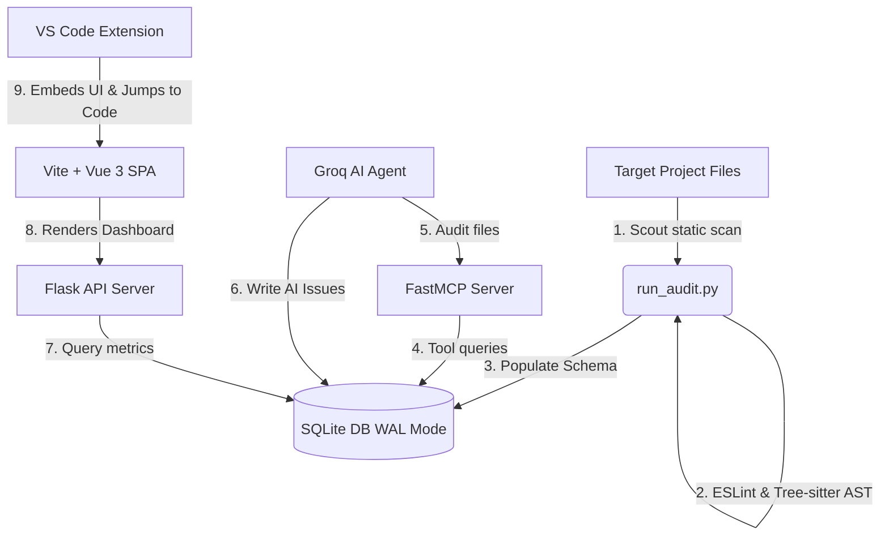

# Code Audit Librarian 📚🔬

A high-performance, decoupled codebase static analysis and AI auditing engine. The tool parses Vue 2/3 Single File Components (SFCs), extracts dependency graphs, evaluates ESLint / accessibility violations, and runs context-aware architectural audits utilizing a Groq-powered AI pipeline.

---

## 🏗️ System Architecture

The application is structured into four decoupled, highly integrated layers:



1. **Scout Static Analyzer (`audit_tool`)**: Grammar-aware tree-sitter parser splits Vue files into block-level components. Triggers custom API pattern matchers and local ESLint rules.
2. **AI MCP Agent (`mcp_agent`)**: Bootstraps a FastMCP client exposing database views as tools. Runs context-limited LLM quality scans via user-configurable API loops.
3. **Flask Server & Dashboard SPA (`report`)**: A robust Flask API layer reading from local WAL storage, serving an interactive dashboard built on a standalone Vite + Vue 3 stack.
4. **VS Code Extension (`vscode-extension`)**: Integrates the dashboard directly into a VS Code editor panel, enabling interactive split-screen diff previews and instant jump-to-code navigation.

---

## 🔒 Portability & Security Constraints

- **Single Database Context**: The database uses **SQLite in WAL (Write-Ahead Logging) mode**. This handles concurrent reads and writes between the scanning engine, the Flask API, and the MCP agent. The databases (`*.db`, `*.db-wal`, `*.db-shm`) are isolated from Git to guarantee that each developer environment initializes its own baseline schema.
- **Isolate Configs**: The application handles sensitive Groq endpoints, local model names, and file paths using a local `.env` file, preventing private scopes or token leaks.
- **Urllib fallback**: Relies on optimized urllib loops internally when connecting to local or remote AI completions to cut down dependency bloat.

---

## 🚀 Rapid Bootstrap Setup

Follow these steps to initialize your environment, compile dependencies, and trigger a clean scan.

### 1. Initialize Python Environment & Install Core Requirements
Open a terminal in the project root:
```bash
# Create virtual environment
python -m venv venv

# Activate virtual environment
# Windows:
.\venv\Scripts\activate
# Linux/macOS:
source venv/bin/activate

# Install requirements
pip install -r audit_tool/requirements.txt
```

### 2. Configure Environment Secrets
Create a `.env` file at the project root:
```ini
# Groq completion settings
OPENWEBUI_BASE_URL=https://api.groq.com/openai/v1
OPENWEBUI_API_KEY=your-groq-api-key
LLM_MODEL=llama-3.3-70b-versatile

# Testing bounds (0 for scanning all Vue files in target)
AI_FILE_LIMIT=5
```

Modify `audit_tool/config/project_config.yaml` to point `base_path` to your target codebase path.

### 3. Compile the VS Code Extension
Open a terminal in the `vscode-extension` subdirectory:
```bash
# Install node packages
npm install

# Compile typescript
npm run compile
```
To test, open VS Code, open the Extension sidebar (`Ctrl+Shift+X`), click `...` -> **Install from VSIX...**, and select `vscode-extension/code-audit-librarian-1.0.0.vsix`.

### 4. Execute a Full Codebase Audit
Navigate to `audit_tool` and trigger a full scan (detaching report launchers):
```bash
cd audit_tool
..\venv\Scripts\python.exe run_audit.py --no-report
```

To run both the scan and keep the interactive dashboard servers alive concurrently:
```bash
..\venv\Scripts\python.exe run_audit.py
```
Open **[http://localhost:5173/](http://localhost:5173/)** to see the results.
